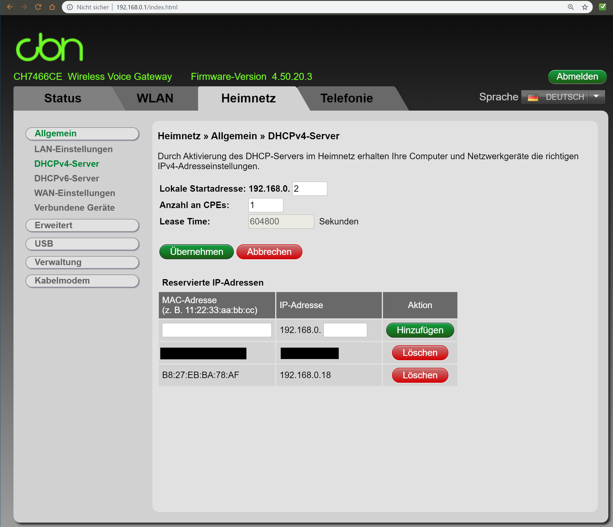
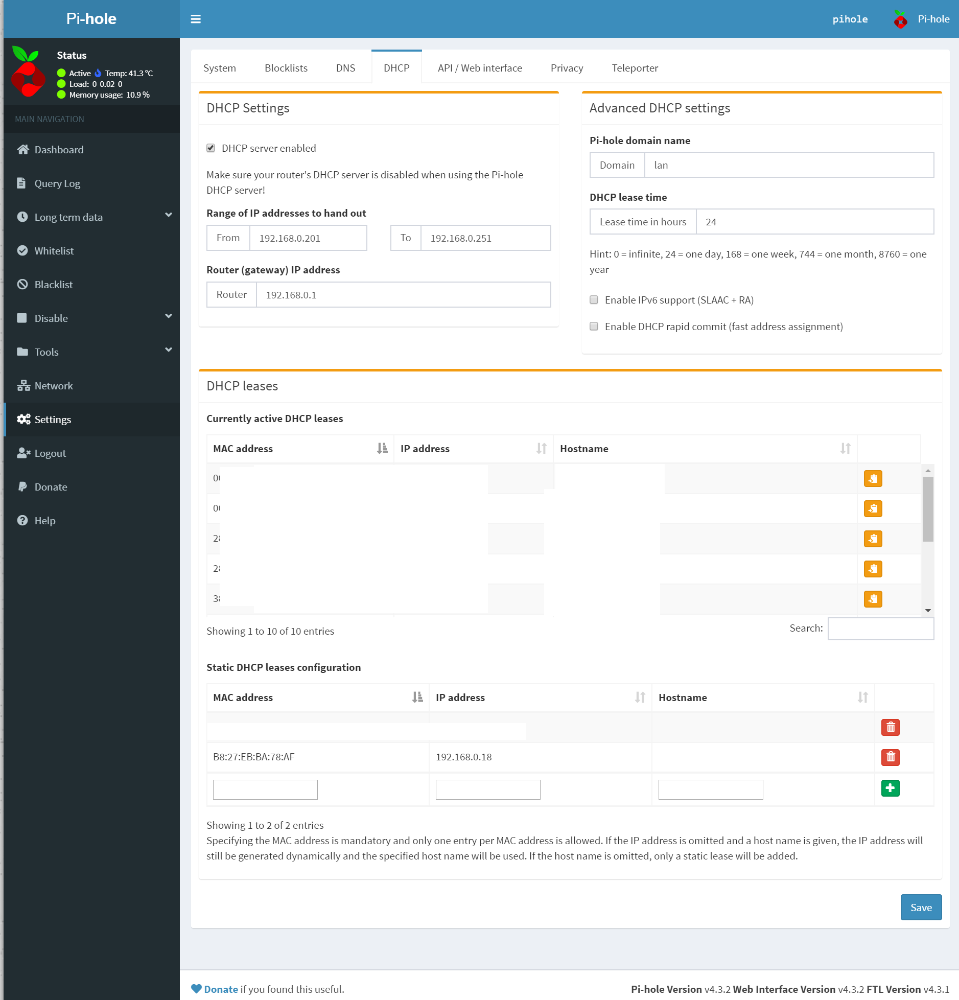

CBN CH7466CE (Firmware-Version  4.50.20.3)

1.)  im Router-Webinterface unter Heimnetz > Allgemein > DHCPv4 Server die
"Anzahl an CPEs" auf 1 (kleinster möglicher Wert, 0 ist nicht erlaubt)
stellen, damit der DHCP-Server des Routers kein (bzw. nur ein) Lease
vergibt. Ich habe hier um auf Nummer sicher zu gehen noch die IP-Adresse
des PiHole reserviert. Ein vollständiges Abschalten des DHCP-Servers
scheint übrigens nicht möglich zu sein.

2.) im PiHole-Webinterface als Admin anmelden und unter Settings > DHCP den
DHCP-Server des PiHole aktivieren und nach Wunsch konfigurieren.

In meinem Netzwerk haben von 10 Hosts alle bis auf einen (Apple-Gerät)
korrekt ihre Netzwerkschnittstelle konfiguriert, d.h. sie benutzen den
PiHole als DNS-Server.

Nicht wirklich eine saubere Lösung, aber es scheint zu funktionieren und
ist damit eventuell für Benutzer, die keine zusätzliche Hardware kaufen
möchten, interessant.

