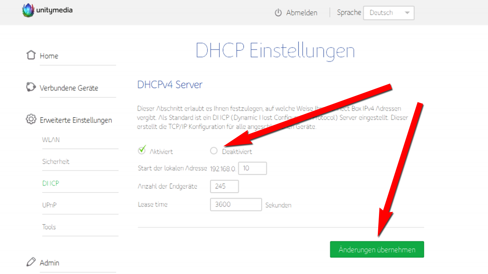
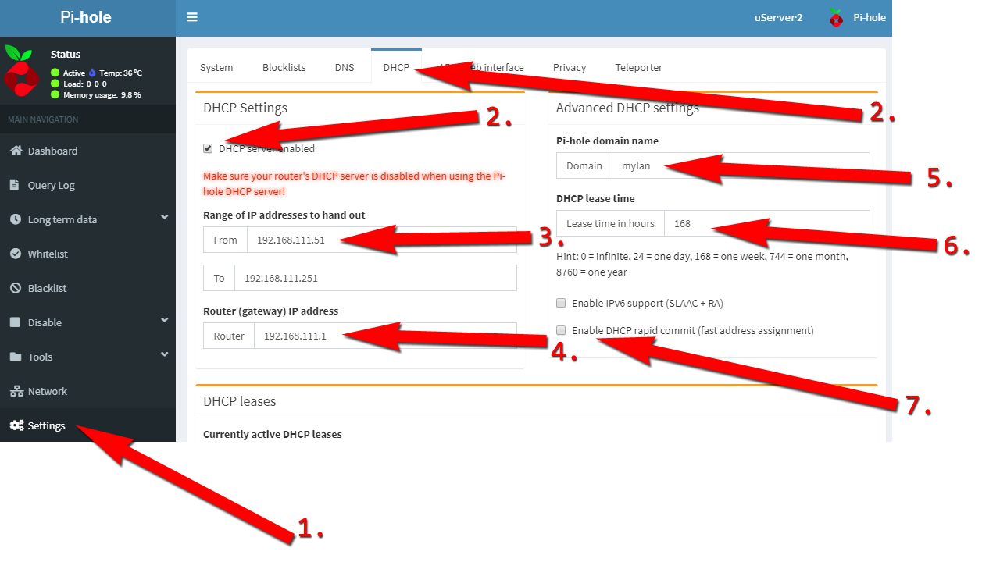
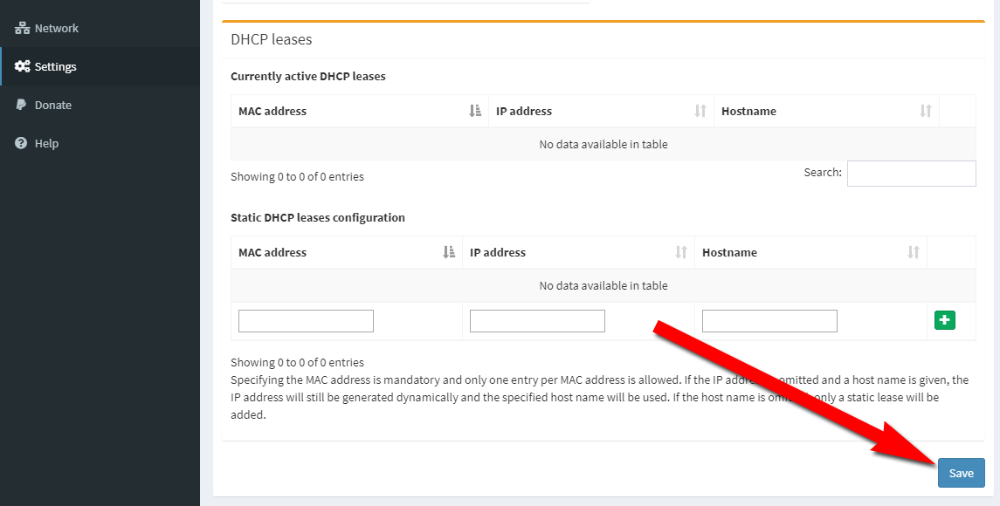

Unitymedia Connect Box

Auf dem Pi-hole geht es dann weiter...

1. Im Menü auf der linken Seite "Settings" klicken 
2. "DHCP Server enabled" anklicken 
3. Startbereich der IPs ändern (optional) 
4. Router IP sollte stimmen, muss nicht geändert werden 
5. Domain des LAN kann hier geändert werden (optional) 
6. Überlassungszeit einer IP an die Geräte kann hier geändert werden (optional) 
7. Schnellere IP-Vergabe aktiviern (optional) 

Spätestens jetzt den DHCP-Server im Router abschalten 
"Save"-Button klicken, damit der Pi-hole DHCP-Server gestartet wird 

