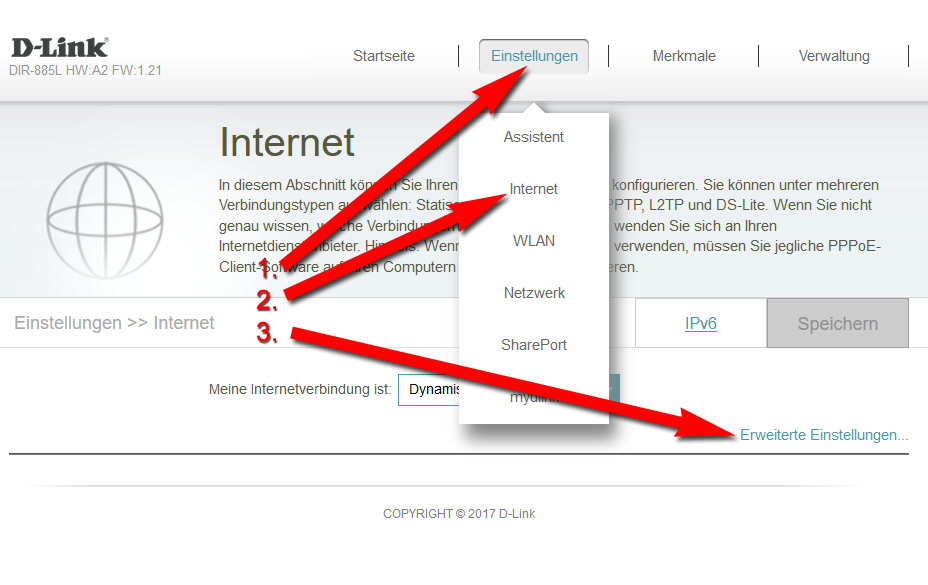
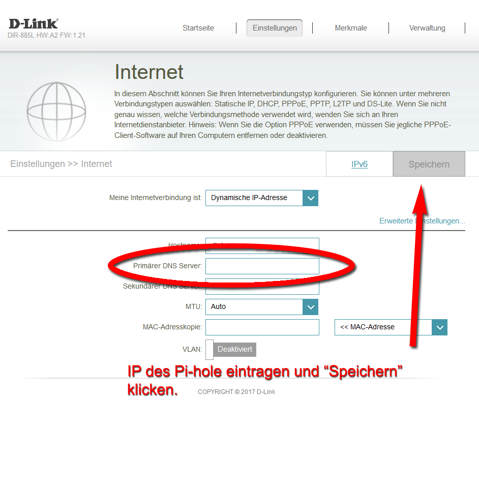

D-Link-DIR-885L HW:A2 Firmware 1.21

# ACHTUNG!

Wenn Sie Ihre Fritzbox nach den unten gezeigten Screenshots konfigurieren, müssen Sie das Pi-hole in den Einstellungen auf einen externen DNS-Server leiten. Sie dürfen Pi-hole bzgl. DNS-Abfragen nicht auf Ihren D-Link Router verweisen.

