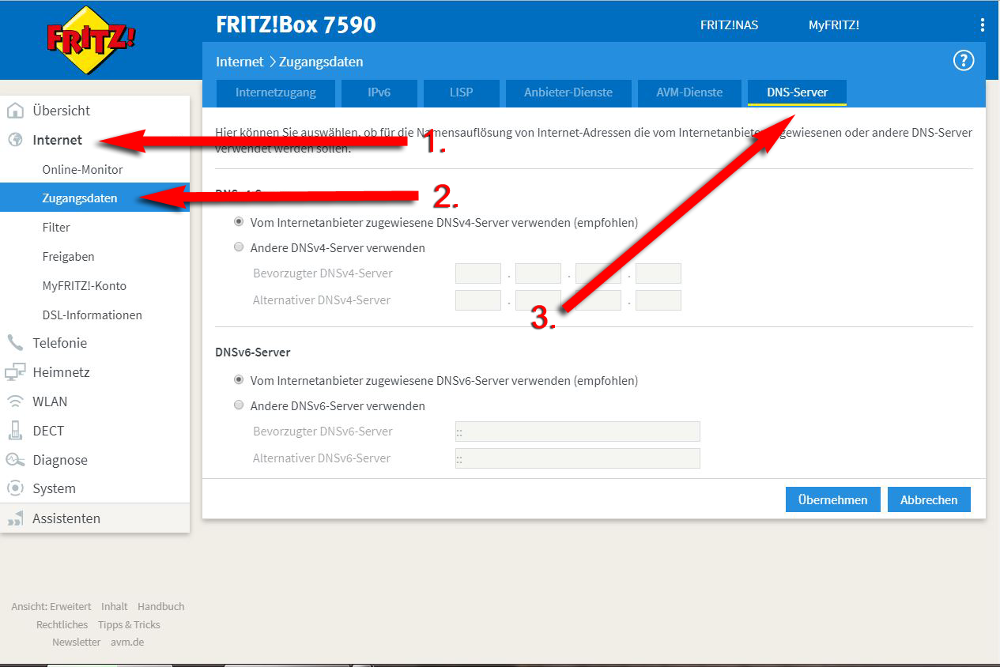
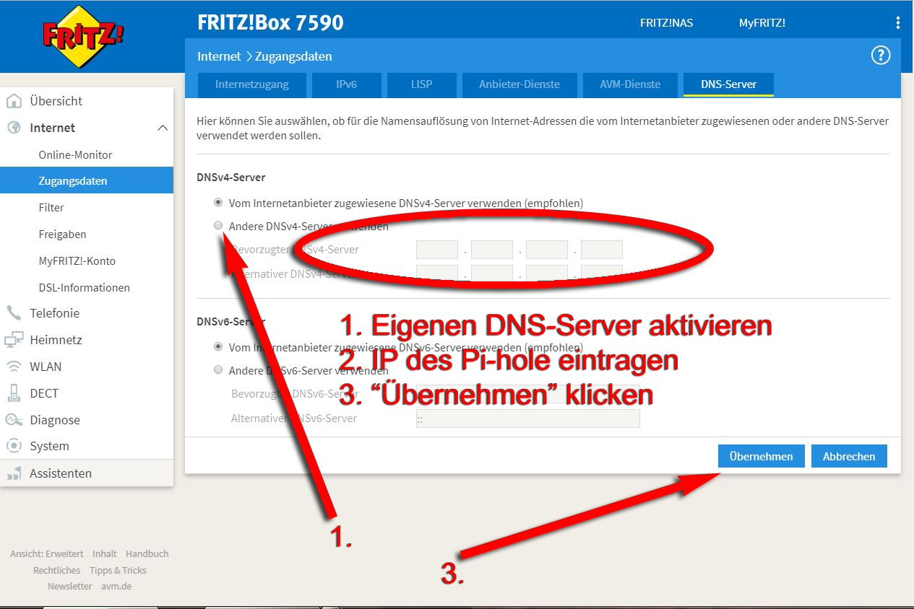

Fritz!Box 7590

# ACHTUNG!

Wenn Sie Ihre Fritzbox nach den unten gezeigten Screenshots konfigurieren, müssen Sie das Pi-hole in den Einstellungen auf einen externen DNS-Server leiten. Sie dürfen Pi-hole bzgl. DNS-Abfragen nicht auf Ihre Fritzbox verweisen.

Eine alternative Anleitung finden Sie unter: https://github.com/RPiList/specials/blob/master/RouterKonfiguration/Fritz!Box%206490%20Cable/readme.md

