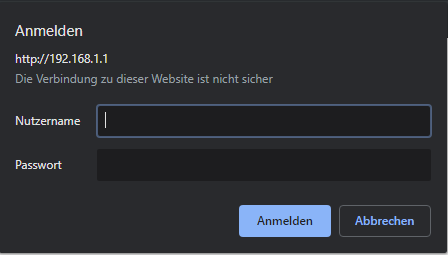
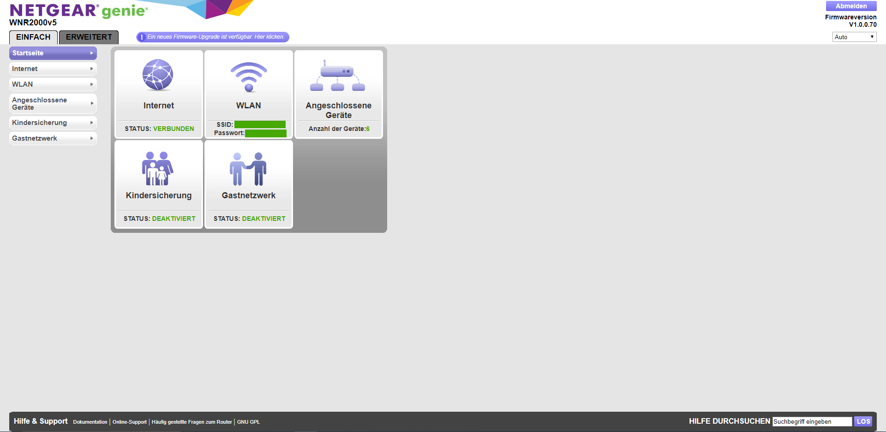
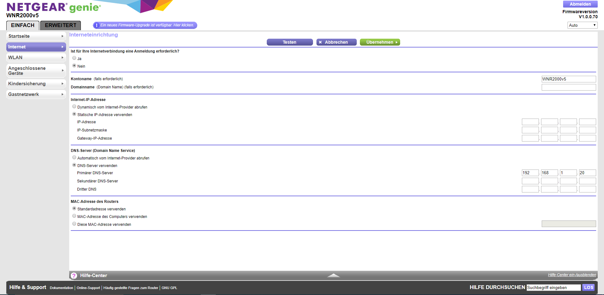

Netgear WNR2000v5/WNR2000v3

Anmeldebildschirm (Chrome)
Info: Hostname ist standardmäßig routerlogin.net (um das Webinterface zu öffnen)

Startseite --> links im Menü auf Internet klicken

Menü Internet --> DNS-Server (Domain Name Service) --> Pi-Hole IP eintragen (und alle anderen IPs in diesem Reiter entfernen!)

