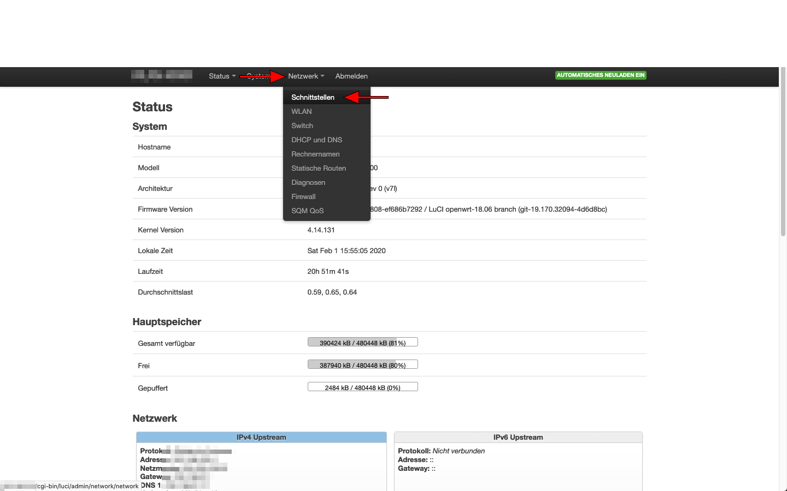
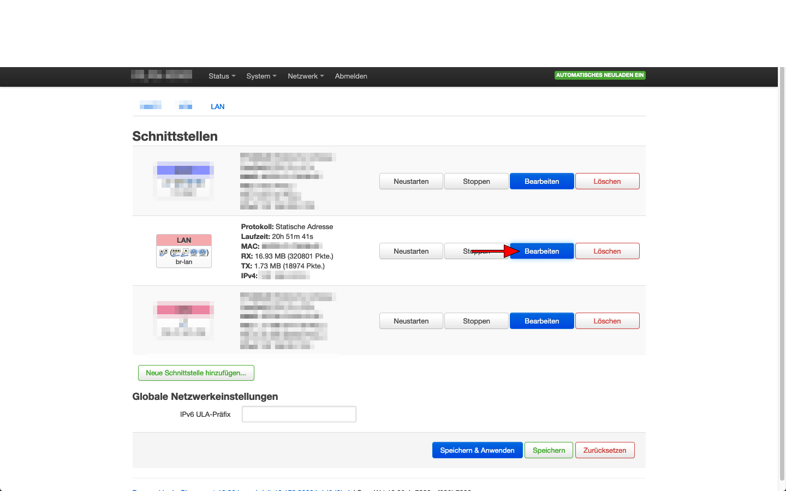

OpenWRT

-Klick auf „Netzwerk“ (englisch "Network")
-Klick auf „Schnittstellen“ (englisch „Interfaces“)

-Klick auf den „Bearbeiten“ (englisch „Edit“) Button des LAN-Interfaces

-Auf der Bearbeiten-Seite des LAN-Interfaces ganz nach unten scrollen
-Klick auf den Reiter „Erweiterte Einstellungen“ (englisch „Advanced Settings“) des DHCP-Servers des LAN-Interfaces
-Im Feld „DHCP-Optionen“ (englisch „DHCP-Options“) das Pi-Hole als DNS-Server eintragen: Syntax: „6, IP.DES.PI.HOLES“
-Klick auf „Speichern und Anwenden“ (englisch „Save & Apply“)
