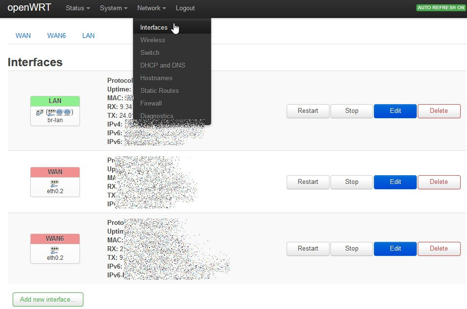
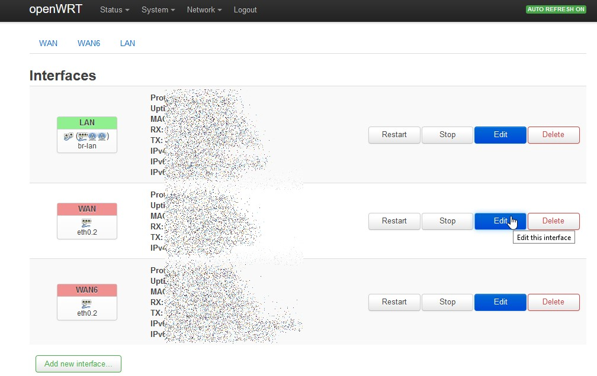
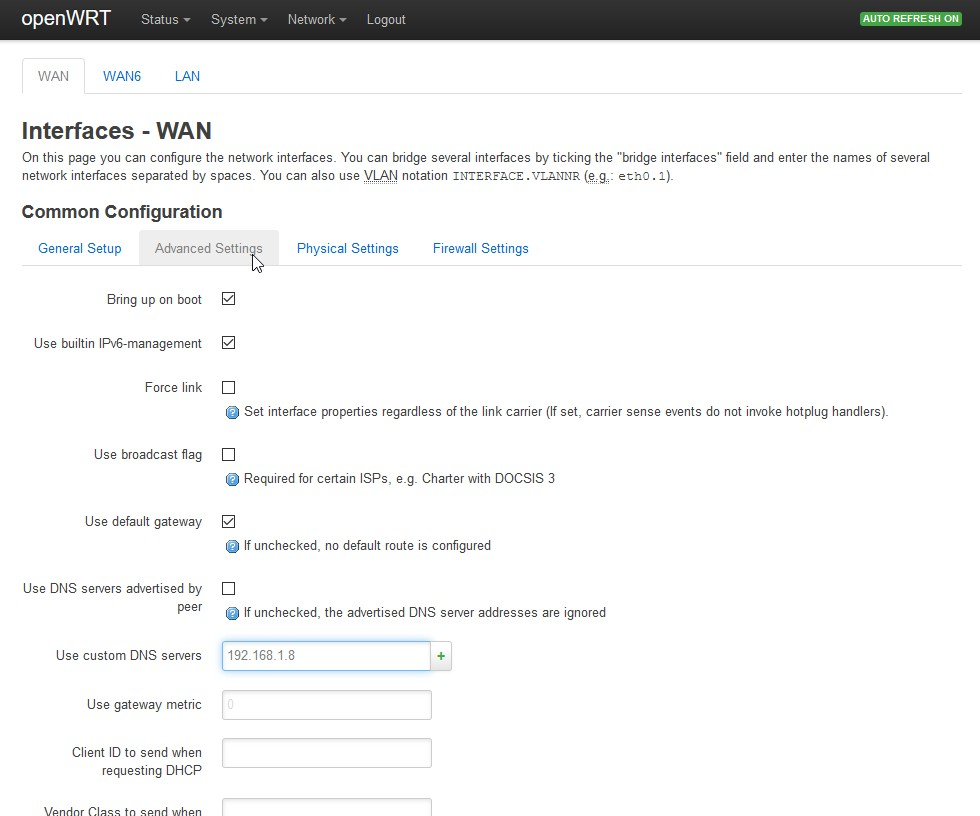
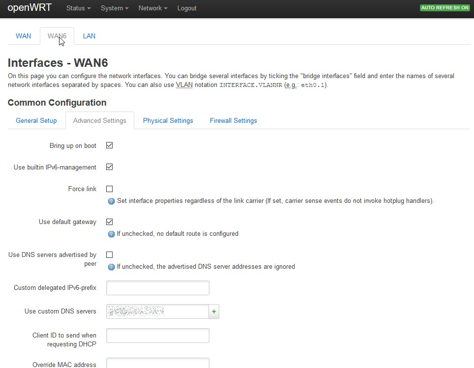
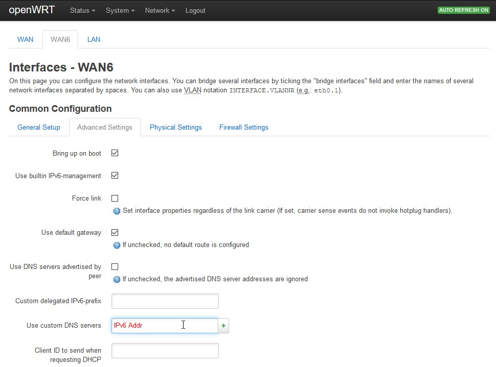

openWRT

Bild 1: Einloggen -> Network -> Interfaces.

Bild 2: WAN bzw. WAN6 bearbeiten.

Bild 3: Unter Advanced Settings die IP eintragen und ggf. das Häkchen bei: „Use DNS servers advertised by peer“ entfernen.

Bild 4: Unter Advanced Settings die IP eintragen und ggf. das Häkchen bei: „Use DNS servers advertised by peer“ entfernen.

Bild 5: Unter Advanced Settings die IP eintragen und ggf. das Häkchen bei: „Use DNS servers advertised by peer“ entfernen.

