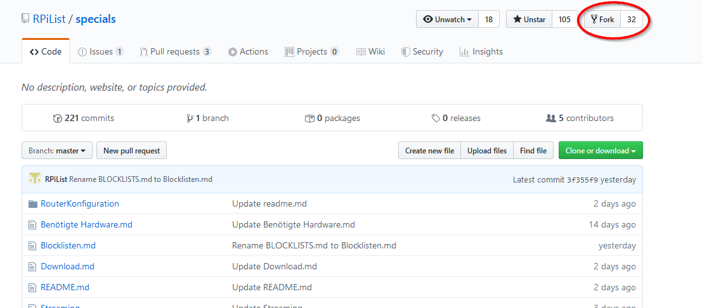
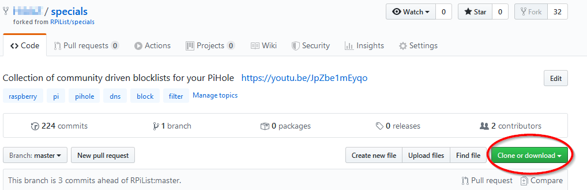
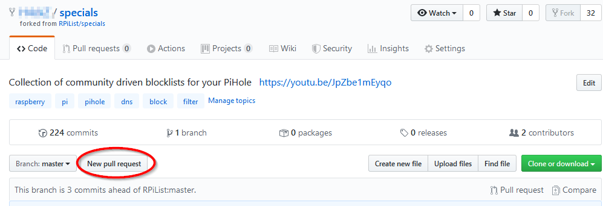
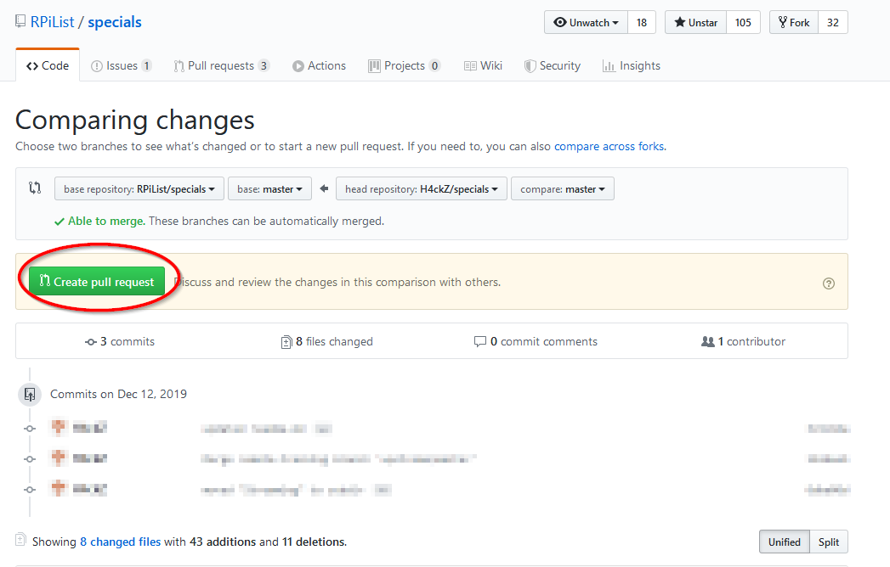

# Pull-Request erstellen

- Einen Fork vom Repository erstellen 

- Zum eigenen Repository wechseln und dieses auf den PC klonen 

- Gewünschte Änderungen durchführen und wieder ins eigene Repository hochladen (commit oder Dateiupload)

- Ihr findet jetzt links über euren Files einen neuen Button "New pull request"

- Jetzt werden in einer kleinen Übersicht alle Änderungen angeführt, die als Pull-Request angeboten werden. Diese einfach durch einen Klick auf den entsprechenden Button bestätigten.

- Fertig. Der Pull-Request ist erstellt und im entsprechenden [Bereich](https://github.com/RPiList/specials/pulls) sichtbar.
