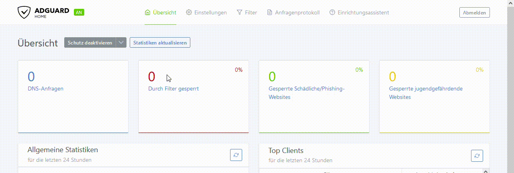

# easy add links to adguardhome

Dieses Script fügt in Adguardhome alle Links aus der [Blocklisten.md](/Blocklisten.md) hinzu

### Hierzu folgendes beachten um das Script ausführen zu können:
- Vorher in AdguardHome alle bisher eingetragenen bzw. die Standard Listen löschen damit, das Script das ohne Probleme einfügen kann.

### Danach das Script herunterladen und ausführbar machen

- Die im Script hinterlegten "Hinweise" ebenfalls vor der ausführung beachten und dann das Script ausführen.
